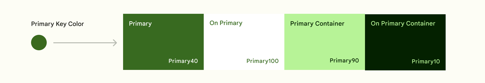
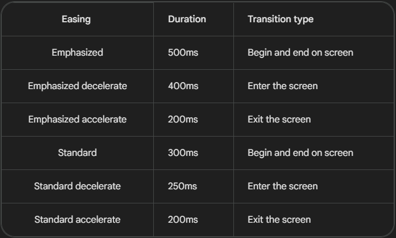
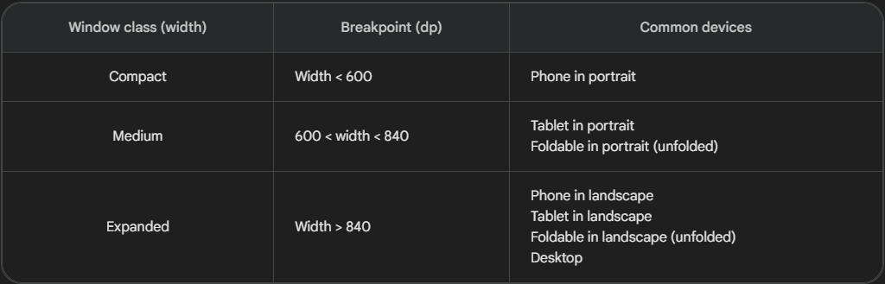
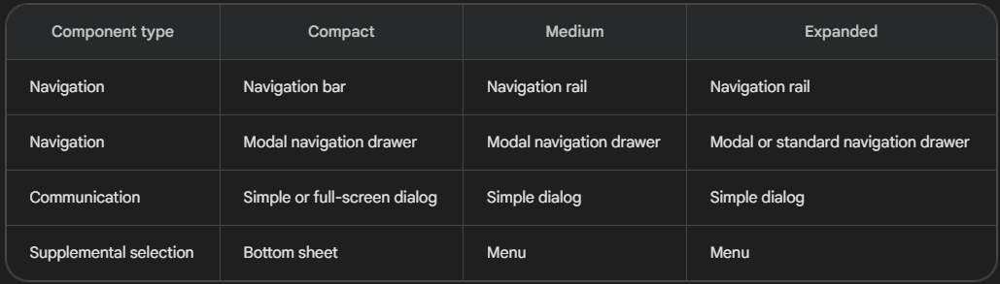
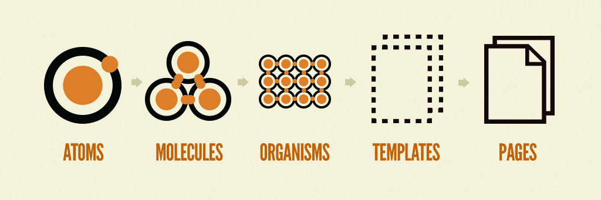
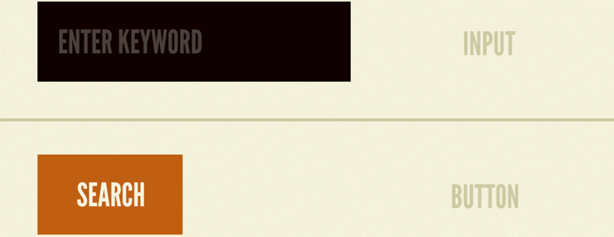
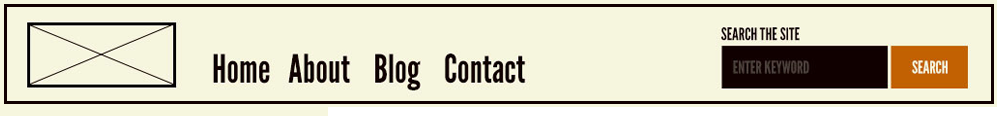
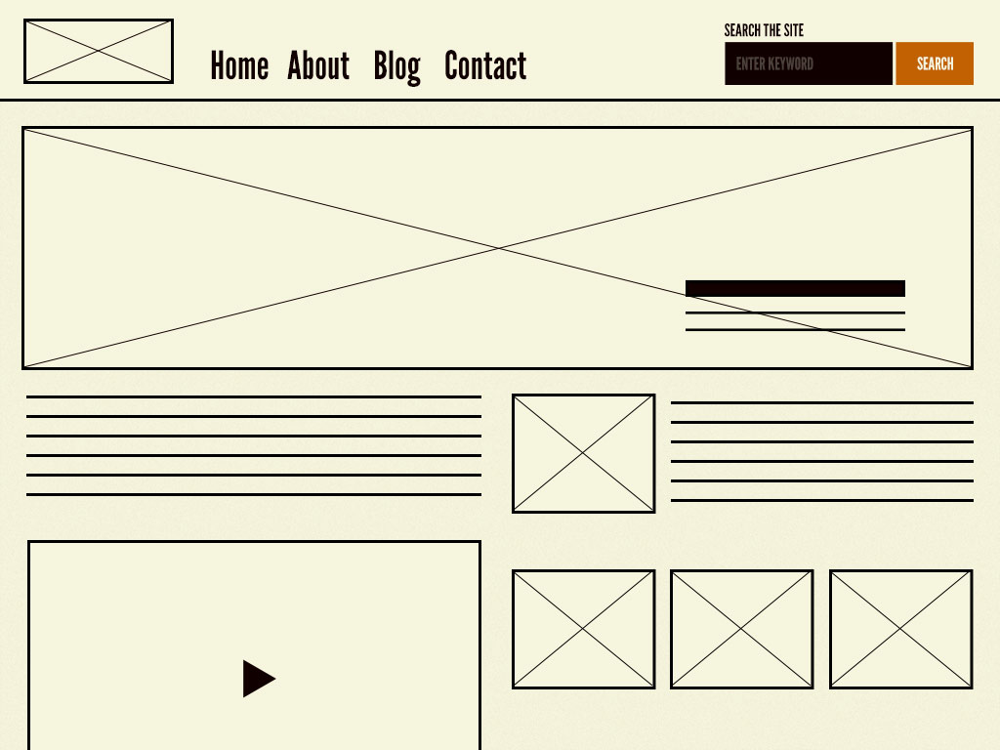
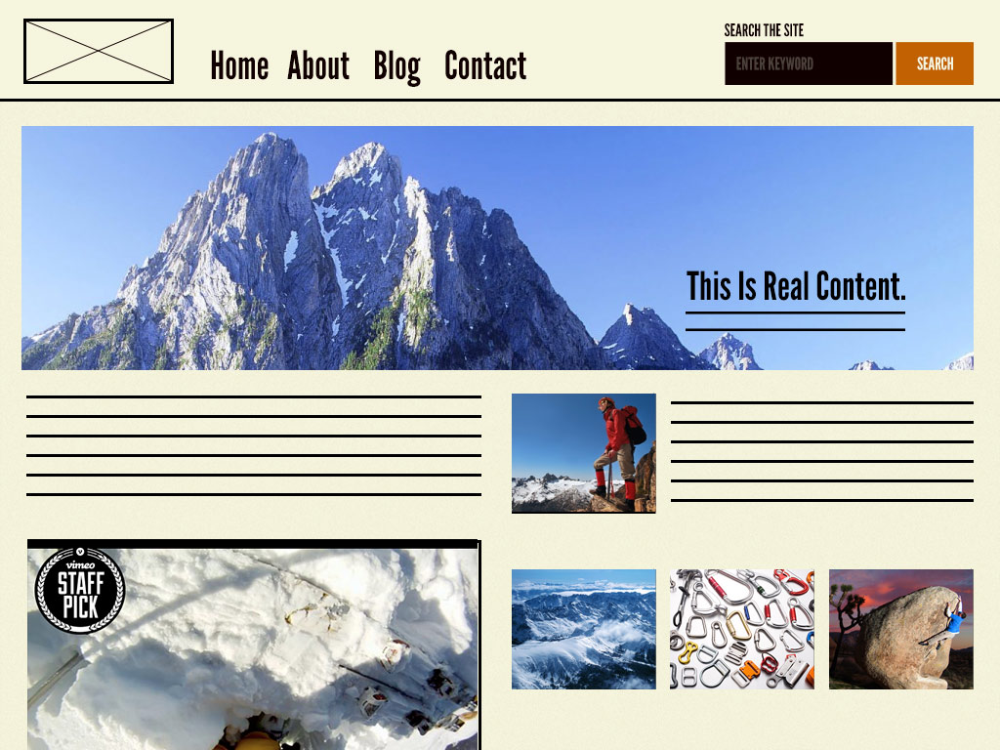

# Svelte Starter Template

This is my svelte starter template using material design's UI with TailwindCSS and following atomic design. ([What Is Atomic Design ?](#what-is-atomic-design)) As Material Design 3.0 is not yet (2/15/2023) available for web, I used their figma design kit to recreate everything, following their [guides on styling](https://m3.material.io/styles).

## Table of contents

- [Svelte Starter Template](#svelte-starter-template)
  - [Table of contents](#table-of-contents)
  - [Where To Start](#where-to-start)
  - [How to modify](#how-to-modify)
  - [Contribution](#contribution)
  - [The rest below should be migrated to the wiki](#the-rest-below-should-be-migrated-to-the-wiki)
  - [Material Design](#material-design)
    - [Color Roles](#color-roles)
      - [Surface Colors](#surface-colors)
      - [Dark Theme](#dark-theme)
      - [Custom Colors](#custom-colors)
    - [Icons](#icons)
      - [Target Size](#target-size)
    - [Transitions](#transitions)
    - [Responsiveness](#responsiveness)
    - [Sizes](#sizes)
    - [Figma Design Kit](#figma-design-kit)
  - [What Is Atomic Design](#what-is-atomic-design)
    - [Atoms](#atoms)
    - [Molecules](#molecules)
    - [Organisms](#organisms)
    - [Templates](#templates)
    - [Pages](#pages)
    - [More](#more)

## Where To Start

Get this [tool](https://m3.material.io/theme-builder#/custom) and choose your primary and tertiary color (secondary is auto-generated from primary).  
Then open the tailwind.config.cjs file and into `theme:` replace the colors I put there with yours, or keep mine if you like them.

## How to modify

The base is a template listing website that lists every component from material UI, using these same components. You can find all Matreial Design components in `lib/components/base`, and I advise you to not modify them unless you have read the whole material UI website. Each component has parameters that you can give them to customize them without having to modify them directly. You should only modify the `layout` folder, or create any new component.

## Contribution

If you see any problem with a component (lack of responsiveness, bad technique) please open an issue or pull request and I will gladly accept you if you are following Material Design. I also accept enhancements to the SvelteKit server in general, but only general-usage ones. (e.g: I won't add MDSVEX, as this is not meant to be a blog)

## The rest below should be migrated to the wiki

## Material Design

[Material Design](https://m3.material.io/) is a design system built by Google. It's basically a guide on how to make a good UI/UX, talking about all sorts of topics.

### [Color Roles](https://m3.material.io/styles/color/the-color-system/color-roles)

There is a tool to create custom material colors [here](https://m3.material.io/theme-builder#/custom).

On a range where 0 is black, 50 is pure color and 100 is white this is what Material recommends for an example primary color (you can apply it to your secondary and tertiary too):

- Primary: 40 (just base color)
- On Primary: 100 (as in background when primary is used for the content)
- Primary Container: 90 (just base color but for less emphasis)
- On Primary Container: 10 (as in background when primary container is used for the content)

TailwindCSS colors ranges from 0 to 1000, so we will just add a 0, 400 for the primary, 1000 (just use white) for the On Primary, etc...

For neutral values, this is a bit different. In order, it is: 99, 10, 99, 10 neutrals (Background, On B, Surface, On S). Why 99 ? 99 Is the type of color that is white, but not white. See the picture up there, the background is very close to white, but it is not, and is more pleasing to look at.

#### Surface Colors

Surface colors are a bit special. Yes they use neutral for their main color, but they also have 5 elevations. These are to make the experience lass flat for the user, and create elevations through the use of different surface colors.  
They are done by adding a layer of the primary color on top of the surface with different opacity: (Here 1. is elevation 1)

1. 5% Opacity
2. 8% Opacity
3. 11% Opacity
4. 12% Opacity
5. 14% Opacity

#### Dark Theme

They also provide values for a dark theme, here they are:
80, 20, 30, 90 for normal colors.
10, 90, 10, 90 for neutral colors.

#### Custom Colors

**If you do use custom colors, please make sure they are accessible even for color blind people, you can use [adobe's tool](https://color.adobe.com/create/color-accessibility) to check that.**  
If you need to use custom colors, please use the behavior that the primary color is using. Again, you can use the tool I gave at the top of this page.

### Icons

All icons used to this day come from [google fonts icons](https://fonts.google.com/icons) and there is only 4 sizes if icons you should use:

- 20x
- 24x
- 40x
- 48x

Other things:

- For 24x or under, don't go under 200 weight, I would even say 300 tbh.
- Don't use different weights for icons in a group unless it is an active or selected element.
- Don't use different weights for text and icons when put next to each other.
- If icons are not decorative, make them accessible by using a label text.

#### Target Size

You usually want a target that is 2x the size of the icon for 24x or 20x icons. The target is where the user can click, so the user should be able to click a litle bit around the icon and it would still work.

### Transitions

Here is a table of the transition duration and easing for the type of transition. This should give you a good idea of what to use when.

### Responsiveness

Two tables that represent what size corresponds to what window class, and what to use for each window class.
PS: I followed their Figma Design Kit and the breakpoints there don't follow the ones you have on screen right now. They are quite close, so I kept the ones from figma.

### Sizes

Considering we are using the default [TailwindCSS spacing](https://tailwindcss.com/docs/customizing-spacing#default-spacing-scale), you should only use whole numbers and you should almost never use more than size-12 (48px), if you need more, consider using auto margins to make things responsive and flexible.

### Figma Design Kit

You can find their figma design kit [here](https://www.figma.com/community/file/1035203688168086460), even if you don't plan on following material design's guidelines it can always be a good thing to get some inspiration and see what the best companies in the world are producing.

## What Is Atomic Design

To summarize [[this article]](https://atomicdesign.bradfrost.com/chapter-2/), Atomic Design is destructuring a website into little portions of itself. It has 5 stages :

1. Atoms
2. Molecules
3. Organisms
4. Templates
5. Pages

### Atoms

Atoms are often pure HTML elements, like a button, an input, things that can't be destructured any more.

### Molecules

We will see them as simple structures of atoms together, a search bar for example. A mix of a label, input and a button.

### Organisms

We will see them as a relatively complex structures of molecules or atoms together, a header for example. A mix of a logo [atom/molecule], a navbar [molecule] and the search form [molecule].

### Templates

We will see them as groups of organisms and molecules together that can be complex. They are used to articulate the wanted design of the page to see the final design and also account for what needs to be responsive.

### Pages

Pages are instances of templates that show real content in action, like... pages.

### More

If you want to read more about atomic design, [see this website.](https://atomicdesign.bradfrost.com/)
